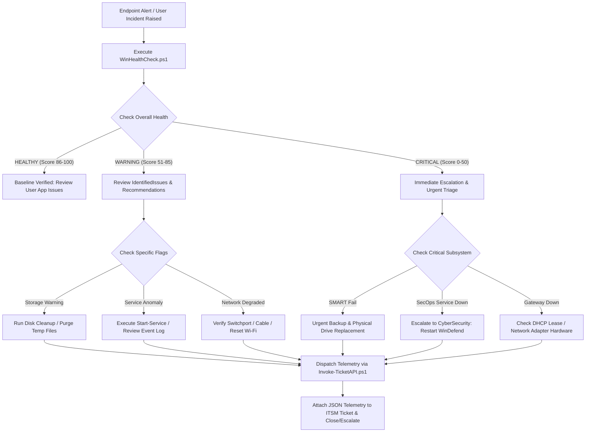

# Windows Desktop Diagnostics & Incident Telemetry Suite (ITIL Tier-1 / Tier-2)

An enterprise-grade, modular PowerShell diagnostic and automation utility designed for Tier-1/Tier-2 IT desktop support engineers, Systems Administrators, and RMM/ITSM automation pipelines.

The suite performs non-destructive health audits across critical workstation subsystems (storage, services, event logs, and network connectivity), calculates an automated ITIL health score, and securely dispatches structured diagnostic telemetry to enterprise REST APIs (e.g., ServiceNow, Jira Service Management, Datadog, Splunk, or custom webhooks).

---

## 1. Architecture & File Structure

```
IT-Diagnostics-Suite/
├── WinHealthCheck.ps1           # Master diagnostic engine & triage report generator
├── Invoke-TicketAPI.ps1         # Enterprise REST API incident dispatcher with retries
├── sample-payload.json          # Validated ITSM/ITIL telemetry JSON schema artifact
├── README.md                    # Operational runbook, parameter reference, & SOP
└── Tests/
    └── Run-DiagnosticsTest.ps1  # Automated regression & integration test runner
```

### Component Breakdown:
* **`WinHealthCheck.ps1`**: The core diagnostic collector. Queries logical disk space allocation, physical SMART drive health, active Windows services (with anomaly detection), recent 24-hour Critical/Error event logs, network adapter bindings, default gateway latency pings, and external DNS resolution. Emits interactive console dashboards, local JSON files, or pipeline objects.
* **`Invoke-TicketAPI.ps1`**: A resilient HTTP POST telemetry dispatcher. Features strict TLS 1.2/1.3 enforcement, SecureString token handling, automated Bearer token masking in logs, exponential backoff with jitter on transient HTTP faults (429, 500, 502, 503, 504), immediate terminal failure on client errors (400, 401, 403, 404), and simulated `-DryRun` execution.
* **`sample-payload.json`**: An enterprise JSON payload demonstrating the exact output structure produced for ITSM incident ticket creation.
* **`Tests/Run-DiagnosticsTest.ps1`**: Self-contained verification suite verifying AST syntax, schema compliance, input bounds rejection, and end-to-end dry-run dispatch.

---

## 2. Prerequisites & Execution Policies

### System Requirements:
* **Operating Systems**: Windows 10, Windows 11, Windows Server 2016, 2019, 2022, 2025.
* **PowerShell Compatibility**: Windows PowerShell 5.1 and PowerShell Core (7.0+).
* **Network**: Outbound HTTPS (port 443) to target ticketing API or webhook (if remote dispatch is enabled).

### Execution Policy Configuration:
If script execution is restricted by default Windows execution policies, execute using one of the following methods:

```powershell
# Method 1: Bypass execution policy for the current PowerShell process only (recommended for technicians)
Set-ExecutionPolicy -Scope Process -ExecutionPolicy Bypass -Force

# Method 2: Execute directly from Command Prompt or RMM agent runner
powershell.exe -NoProfile -ExecutionPolicy Bypass -File ".\IT-Diagnostics-Suite\WinHealthCheck.ps1"
```

### Elevation & Privilege Scope:
| Subsystem Check | Standard User | Administrator (Elevated) |
| :--- | :--- | :--- |
| **System Metadata & Uptime** | ✅ Full Access | ✅ Full Access |
| **Logical Disk Free Space** | ✅ Full Access | ✅ Full Access |
| **Physical Disk & SMART Health** | ⚠️ Partial (`Get-PhysicalDisk` depending on OS) | ✅ Full Access (`Get-PhysicalDisk` + WMI SMART predictor) |
| **Monitored Service States** | ✅ Full Access (Read service states) | ✅ Full Access |
| **Application Event Logs** | ✅ Full Access | ✅ Full Access |
| **System Event Logs** | ⚠️ Read permission depends on group policy | ✅ Full Access |
| **Network & Gateway Ping** | ✅ Full Access | ✅ Full Access |
| **API Telemetry Dispatch** | ✅ Full Access | ✅ Full Access |

*Note: While `WinHealthCheck.ps1` executes gracefully under standard user contexts (reporting `"ExecutionElevated": false`), running in an elevated prompt (`Run as Administrator`) is recommended to ensure complete event log and hardware SMART status inspection.*

---

## 3. Master Script: `WinHealthCheck.ps1`

### Parameter Reference:

| Parameter | Type | Default | Description |
| :--- | :--- | :--- | :--- |
| `-DiskWarningThresholdPercent` | `[int]` | `15` | Percentage of free disk space below which a drive triggers a `WARNING` flag (1–90%). |
| `-DiskCriticalThresholdPercent` | `[int]` | `5` | Percentage of free disk space below which a drive triggers a `CRITICAL` flag (1–50%). |
| `-TargetServices` | `[string[]]` | `Spooler, RemoteRegistry, wuauserv, LanmanWorkstation, Dnscache, Dhcp, WinDefend, MpsSvc` | Array of service names monitored for operational health and security baselines. |
| `-EventLogHours` | `[int]` | `24` | Lookback window in hours for Critical (Level 1) and Error (Level 2) event log entries (1–168 hours). |
| `-MaxEventLogEntries` | `[int]` | `50` | Maximum number of individual event records included in the payload (5–500). |
| `-OutputPath` | `[string]` | `$null` | File path on disk to output the generated JSON diagnostic report. |
| `-LogFilePath` | `[string]` | `$null` | File path on disk where script execution logs will be appended. |
| `-SendTicket` | `[switch]` | `False` | Triggers automated invocation of `Invoke-TicketAPI.ps1` to dispatch diagnostic data. |
| `-ApiEndpoint` | `[string]` | `$null` | HTTPS endpoint URL where diagnostic payloads are transmitted. |
| `-ApiToken` | `[SecureString]` | `$null` | SecureString bearer authentication token. |
| `-ApiTokenPlain` | `[string]` | `$null` | Plaintext string bearer token (safely converted in memory; never logged). |
| `-DryRun` | `[switch]` | `False` | Validates payload and simulates API transmission without sending network packets. |
| `-PassThru` | `[switch]` | `False` | Returns the raw PowerShell diagnostic object to the pipeline. |
| `-AsJson` | `[switch]` | `False` | Emits formatted JSON directly to standard output. |
| `-Quiet` | `[switch]` | `False` | Suppresses interactive console banners and progress logs (ideal for RMM tasks). |

---

## 4. Subsystem Diagnostic Checks

### 1. Storage & Drive Health
* **Logical Volumes**: Evaluates drive letter, volume label, file system (NTFS, ReFS, FAT32), total capacity (GB), free space (GB), and free space percentage. Drives under the warning threshold (default 15%) or critical threshold (default 5%) are explicitly flagged.
* **Physical Disks & SMART Status**: Uses `Get-PhysicalDisk` to query drive friendly name, bus type (NVMe, SATA, SAS), media type (SSD, HDD), and operational health. Falls back to WMI `MSStorageDriver_FailurePredictStatus` (`root\wmi`) to query physical drive failure predictions.

### 2. Windows Service States & Anomaly Rules
* **Monitored Services**: Queries Name, DisplayName, Status (`Running`, `Stopped`), StartType (`Automatic`, `Manual`, `Disabled`), and the running service account (`StartName`).
* **Anomaly Detection Rules**:
  * `ANOMALY_STOPPED`: Triggered if a service is configured for `Automatic` start but is in a `Stopped` state (e.g. hung Print Spooler).
  * `SECURITY_REVIEW`: Triggered if `RemoteRegistry` is actively running (violates zero-trust hardening baselines).
  * `SECURITY_CRITICAL`: Triggered if endpoint security services (`WinDefend` or `MpsSvc`) are stopped.

### 3. Recent Critical Event Log Errors
* **Filtered Scope**: Queries the last 24 hours of `Application` and `System` logs using optimized `Get-WinEvent` hash tables for **Level 1 (Critical)** and **Level 2 (Error)** records.
* **Payload Sanitation**: Strips disruptive carriage returns, sanitizes formatting, and truncates long stack traces to prevent payload bloating.
* **Recurring Error Clustering**: Automatically groups events by `EventId` and `ProviderName` to highlight recurring systemic failures (e.g. DCOM timeouts, VSS writer failures, BitLocker driver warnings).

### 4. Network Configuration & Latency Ping
* **Adapter Configuration**: Discovers all active adapters (`Status = Up`), resolving MAC addresses, link speeds, IPv4/IPv6 addresses, subnet masks, default gateways, and DNS servers.
* **Gateway Latency Test**: Sends 4 ICMP echo requests to the primary IPv4 default gateway via `Test-Connection`, measuring minimum, maximum, and average latency (ms) and packet loss percentage.
  * `EXCELLENT`: 0% packet loss and latency < 25ms.
  * `FAIR`: 0% packet loss and latency between 25ms and 80ms.
  * `DEGRADED`: Packet loss > 0% or latency > 80ms.
  * `UNREACHABLE`: 100% packet loss.
* **External DNS Reachability**: Validates end-to-end name resolution by resolving `dns.google` and measuring DNS response time in milliseconds.

### 5. ITIL Automated Health & Triage Engine
The triage engine calculates an overall system health score (0–100) and grade (`HEALTHY`, `WARNING`, `CRITICAL`):
* System starts with a base score of 100 points.
* Deducts points based on severity:
  * -30 points for volume space < 5%; -10 points for volume space < 15%.
  * -40 points for SMART drive failure prediction flag.
  * -25 points for stopped security services (`WinDefend`, `MpsSvc`); -10 points for stopped automatic services.
  * -10 points per Critical (Level 1) event log error; -10 points for high error volume (>25 errors).
  * -40 points if default gateway is unreachable; -15 points for degraded latency/packet loss; -15 points for failed DNS resolution.
* Automatically compiles two actionable arrays:
  * `IdentifiedIssues`: High-level bulleted symptoms for ticketing summaries.
  * `RecommendedActions`: Step-by-step triage remediation instructions for Tier-1/Tier-2 support technicians.

---

## 5. API Dispatch Module: `Invoke-TicketAPI.ps1`

### Parameter Reference:

| Parameter | Type | Default | Description |
| :--- | :--- | :--- | :--- |
| `-ApiEndpoint` | `[string]` | *Mandatory* | HTTPS REST URL of the ticketing or telemetry receiver. |
| `-Payload` | `[object]` | *Mandatory* | Diagnostic data (accepts `PSCustomObject`, `Hashtable`, or valid JSON string). |
| `-BearerToken` | `[SecureString]` | `$null` | SecureString authentication token. |
| `-PlainToken` | `[string]` | `$null` | Plaintext token (auto-secured in memory; redacted in logs). |
| `-CustomHeaders` | `[hashtable]` | `@{}` | Optional custom HTTP headers (e.g. `X-Environment = "Production"`). |
| `-MaxRetries` | `[int]` | `3` | Maximum retry attempts for transient server errors (1–10). |
| `-RetryDelaySeconds` | `[int]` | `2` | Initial retry backoff interval in seconds (1–60). |
| `-TimeoutSeconds` | `[int]` | `30` | HTTP connection and read timeout in seconds (5–180). |
| `-DryRun` | `[switch]` | `False` | Validates JSON structure and logs request headers without sending HTTP traffic. |
| `-PassThru` | `[switch]` | `False` | Emits transmission result object (StatusCode, Latency, ResponseBody) to the pipeline. |
| `-LogFilePath` | `[string]` | `$null` | Destination audit log file on disk. |

### Enterprise Reliability & Security Features:
1. **Cryptographic Standards**: Automatically enforces `[System.Net.SecurityProtocolType]::Tls12` and `Tls13`.
2. **Zero Credential Leakage**: Tokens are masked in console output and logs (e.g., `Bearer ********************2345`). Plaintext tokens are handled safely and unmanaged memory pointers are freed immediately with `ZeroFreeBSTR`.
3. **Distributed Tracing**: Automatically generates a unique UUID `X-Correlation-ID` header for every request to facilitate tracing across API gateways and ITSM systems.
4. **Transient Retry & Exponential Backoff**:
   * Evaluates transient status codes (`408`, `429`, `500`, `502`, `503`, `504`) and transport errors.
   * Backoff formula: $\text{Delay} = (\text{Base} \times 2^{\text{attempt}-1}) + \text{jitter}(100\text{ms}-800\text{ms})$.
   * Respects HTTP `Retry-After` headers if returned by rate-limited endpoints.
5. **Fast-Fail on Client Errors**: Non-transient errors (`400 Bad Request`, `401 Unauthorized`, `403 Forbidden`, `404 Not Found`) fail immediately without retry attempts, logging actionable troubleshooting instructions.

---

## 6. Practical Usage Examples

### Scenario A: Interactive Tier-1 Support Desktop Audit
A technician arrives at a slow workstation or connects via remote assistance:
```powershell
# Run interactive diagnostic scan with full console dashboard
.\IT-Diagnostics-Suite\WinHealthCheck.ps1
```

### Scenario B: Diagnostic Scan with JSON Export
Exporting health data for offline review or attaching to an incident:
```powershell
.\IT-Diagnostics-Suite\WinHealthCheck.ps1 -OutputPath "C:\Temp\Diagnostics\WorkstationHealth.json"
```

### Scenario C: Automated Dispatch to ServiceNow Incident API (Dry-Run Test)
Test incident payload generation without creating live tickets:
```powershell
.\IT-Diagnostics-Suite\WinHealthCheck.ps1 -SendTicket `
    -ApiEndpoint "https://instance.service-now.com/api/now/table/incident" `
    -ApiTokenPlain "snow_bearer_token_abc123" `
    -DryRun
```

### Scenario D: Live Incident Ticket Dispatch
Deploying through an RMM alert action (e.g. user reports machine freezing):
```powershell
.\IT-Diagnostics-Suite\WinHealthCheck.ps1 -SendTicket `
    -ApiEndpoint "https://instance.service-now.com/api/now/table/incident" `
    -ApiTokenPlain "snow_bearer_token_abc123" `
    -LogFilePath "C:\ProgramData\ITDiagnostics\Audit.log" `
    -Quiet
```

### Scenario E: RMM Silent Execution Returning JSON
For integration into RMM agents (Datto RMM, NinjaOne, ConnectWise, Microsoft Intune remediation scripts):
```powershell
$jsonOutput = .\IT-Diagnostics-Suite\WinHealthCheck.ps1 -Quiet -AsJson
Write-Output $jsonOutput
```

### Scenario F: Standalone Telemetry Transmission via `Invoke-TicketAPI.ps1`
Transmitting custom diagnostic data or test payloads:
```powershell
$myDiagnosticData = @{
    Event       = "DiskCleanupCompleted"
    Workstation = $env:COMPUTERNAME
    FreedSpaceGB = 14.2
}

.\IT-Diagnostics-Suite\Invoke-TicketAPI.ps1 `
    -ApiEndpoint "https://telemetry.corp.internal/v1/desktop-events" `
    -Payload $myDiagnosticData `
    -PlainToken "telemetry_token_xyz" `
    -MaxRetries 3 `
    -PassThru
```

---

## 7. Sample JSON Log Payload Schema

Below is an annotated snippet of the structured JSON generated by `WinHealthCheck.ps1` (see `sample-payload.json` for the full 150-line artifact):

```json
{
  "SchemaVersion": "2.0",
  "ReportId": "c84f5e71-92be-48e2-b137-ea5040a43d99",
  "GeneratedAtUtc": "2026-10-04T01:45:00.0000000Z",
  "GeneratedAtLocal": "2026-10-03 21:45:00 -04:00",
  "TriageSummary": {
    "OverallHealth": "WARNING",
    "HealthScore": 80,
    "IssueCount": 2,
    "IdentifiedIssues": [
      "Volume C: is approaching threshold with 12.78% free space (119.23 GB remaining).",
      "Service 'Print Spooler' (Spooler) is configured for Automatic start but is currently Stopped."
    ],
    "RecommendedActions": [
      "Schedule maintenance to purge temp files, clean Windows update cache (C:\\Windows\\SoftwareDistribution), and review storage growth on C:.",
      "Attempt service recovery: Start-Service -Name 'Spooler' and inspect Windows Event Log for crash dumps."
    ]
  },
  "SystemMetadata": {
    "Hostname": "CORP-WKS-8492",
    "Domain": "CORP.GLOBAL",
    "OperatingSystem": "Microsoft Windows 11 Enterprise",
    "Version": "10.0.22631",
    "BuildNumber": "22631",
    "Architecture": "64-bit",
    "InstallDateUtc": "2024-03-12T14:22:10.0000000Z",
    "LastBootUpTimeUtc": "2026-10-01T23:42:18.7315750Z",
    "UptimeHours": 50.2,
    "UptimeFormatted": "2d 2h 11m",
    "CurrentUser": "CORP\\jdoe_adm",
    "Manufacturer": "Dell Inc.",
    "Model": "Latitude 5540",
    "SystemSerialNumber": "9B4T721",
    "BIOSVersion": "1.14.2",
    "PowerShellVersion": "5.1.26100.9549",
    "ExecutionElevated": true
  },
  "StorageHealth": {
    "Thresholds": {
      "WarningPercent": 15,
      "CriticalPercent": 5
    },
    "LogicalDisks": [
      {
        "DeviceID": "C:",
        "VolumeName": "OS_SYSTEM",
        "FileSystem": "NTFS",
        "TotalSizeBytes": 1001416290304,
        "TotalSizeGB": 932.64,
        "FreeSpaceBytes": 128020987904,
        "FreeSpaceGB": 119.23,
        "PercentFree": 12.78,
        "Status": "WARNING"
      }
    ],
    "PhysicalDrives": [
      {
        "DeviceId": "0",
        "FriendlyName": "NVMe PC SN5000S WD 1024GB",
        "MediaType": "SSD",
        "BusType": "NVMe",
        "SizeGB": 953.87,
        "OperationalStatus": "OK",
        "HealthStatus": "Healthy",
        "SmartPredictFailure": false
      }
    ]
  },
  "ServiceStates": {
    "TotalMonitored": 8,
    "HealthyCount": 7,
    "AnomaliesCount": 1,
    "Services": [
      {
        "Name": "Spooler",
        "DisplayName": "Print Spooler",
        "Status": "Stopped",
        "StartType": "Auto",
        "StartName": "LocalSystem",
        "Evaluation": "ANOMALY_STOPPED"
      }
    ]
  },
  "EventLogErrors": {
    "LookbackHours": 24,
    "TotalErrorsRecorded": 5,
    "CriticalErrorsCount": 0,
    "ApplicationErrorCount": 2,
    "SystemErrorCount": 3,
    "TopRecurringEvents": [
      {
        "EventId": 10010,
        "ProviderName": "Microsoft-Windows-DistributedCOM",
        "LogName": "System",
        "Occurrences": 3
      }
    ]
  },
  "NetworkDiagnostics": {
    "NetworkStatus": "HEALTHY",
    "ActiveAdaptersCount": 1,
    "ActiveAdapters": [
      {
        "InterfaceAlias": "Ethernet 1",
        "InterfaceDescription": "Intel(R) Ethernet Connection (17) I219-LM",
        "MACAddress": "00-15-5D-82-41-A0",
        "LinkSpeed": "1 Gbps",
        "Status": "Up",
        "IPv4Addresses": [ "10.100.14.85" ],
        "DefaultGateways": [ "10.100.14.1" ],
        "DnsServers": [ "10.100.0.10", "10.100.0.11" ]
      }
    ],
    "DefaultGatewayPingTest": {
      "TargetGateway": "10.100.14.1",
      "Reachable": true,
      "PacketsSent": 4,
      "PacketsReceived": 4,
      "PacketLossPercent": 0.0,
      "AverageLatencyMs": 2.15,
      "Evaluation": "EXCELLENT"
    },
    "DnsResolutionTest": {
      "TargetDomain": "dns.google",
      "ResolvedIp": "8.8.8.8",
      "ResolutionTimeMs": 14.82,
      "Successful": true
    }
  }
}
```

---

## 8. Tier-1 / Tier-2 IT Support Standard Operating Procedure (SOP)



### Incident Triage Checklist:
1. **Low Disk Space (<15%)**:
   * Inspect `%TEMP%`, `C:\Windows\Temp`, and `C:\Windows\SoftwareDistribution\Download`.
   * Run `cleanmgr.exe /sagerun:1`.
   * Check for oversized user profile folders or orphaned virtual machine disks.
2. **SMART Drive Failure Imminent**:
   * Stop high-throughput read/writes immediately.
   * Perform emergency user data backup (OneDrive/Network share).
   * Dispatch field technician for physical drive swap.
3. **Service Stopped Anomaly**:
   * Run `Start-Service -Name <ServiceName>`.
   * If service fails to stay running, review `Application` event log entries corresponding to the service executable for faulting modules or missing dependencies.
4. **Gateway Latency / Packet Loss**:
   * If packet loss > 0% or latency > 80ms: test alternate switchport, replace patch cable, or check for Wi-Fi interference.
   * Test local ARP table with `arp -a` to identify duplicate IP addresses on the subnet.
5. **Critical DCOM or VSS Errors**:
   * Check VSS writers with `vssadmin list writers`.
   * Reset DCOM permissions if recurring timeout errors persist.

---

## 9. Automated Testing & Verification

The suite includes an automated test runner: `Tests/Run-DiagnosticsTest.ps1`.

### Execution:
```powershell
powershell.exe -ExecutionPolicy Bypass -File ".\IT-Diagnostics-Suite\Tests\Run-DiagnosticsTest.ps1"
```

### Verified Test Cases:
1. **File Existence**: Validates presence of all core scripts, schemas, and runners.
2. **AST Syntax Parsing**: Runs abstract syntax tree validation across `WinHealthCheck.ps1` and `Invoke-TicketAPI.ps1` to prevent runtime syntax bugs.
3. **JSON Schema Integrity**: Parses `sample-payload.json` and verifies that all schema root keys exist.
4. **URL Input Validation**: Asserts that `Invoke-TicketAPI.ps1` rejects malformed or non-HTTP/HTTPS URLs with appropriate exceptions.
5. **Dry-Run API Dispatch**: Validates simulated HTTP 201 Created responses and Bearer token masking.
6. **Live Hardware & OS Extraction**: Validates live extraction of storage, services, event logs, network, and triage scoring.
7. **End-to-End Integration**: Executes `WinHealthCheck.ps1` with `-SendTicket` and `-DryRun` to verify module interoperability.

---

## 10. Security & Quality Assurance Verification (Pillar 3 CyberSecurity)

In adherence to repository quality protocols, this suite underwent strict security verification:
* **Zero Secret Leakage**: API tokens are never written to disk logs. In-memory strings are securely masked (`Bearer **********2345`) in console output and log files. SecureString pointers are cleared from memory via `[System.Runtime.InteropServices.Marshal]::ZeroFreeBSTR`.
* **Transport Layer Security**: Enforces TLS 1.2 and TLS 1.3 protocol standards prior to initializing web requests.
* **Input Validation & Defensive Bounds**: Parameter blocks enforce `[ValidateRange()]`, `[ValidateNotNullOrEmpty()]`, and regular expression checks on all endpoints and numeric thresholds.
* **Denial-of-Service & Rate Limiting Protection**: Network retries employ exponential backoff with randomized jitter and honor HTTP `Retry-After` response headers, avoiding server flood during outages.
* **Payload Sanitation**: All event log error descriptions are stripped of control characters and capped in length to mitigate memory bloat and injection vulnerabilities.
