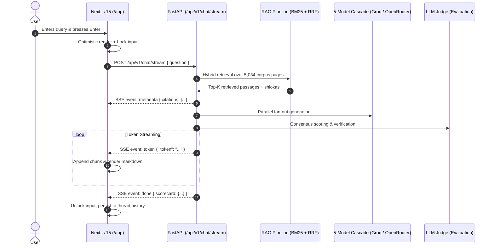

# Implementation Plan: Interactive Chat Page with SSE Streaming & Grounded Vedic Citations

**Branch**: `001-interactive-chat-page` | **Date**: 2026-09-27 | **Spec**: [specs/001-interactive-chat-page/spec.md](file:///c:/Users/Meeta/OneDrive%20-%20Algonquin%20College/Subjects/6/Entrepreneurship/NityaGeeta/specs/001-interactive-chat-page/spec.md)

**Input**: Feature specification from `specs/001-interactive-chat-page/spec.md`

---

## 1. Summary
This implementation plan establishes the architectural blueprint for the Interactive Chat Page (`/app`) in NityaGeeta. The technical approach couples an asynchronous FastAPI backend delivering chunked Server-Sent Events (`text/event-stream`) with a Next.js 15 App Router client running a reactive stream consumer, Framer Motion UI animations, interactive Sanskrit citation drawers, and an explainable multi-model consensus evaluation scorecard.

---

## 2. Technical Context

* **Language/Version**: Python 3.12 (Backend), TypeScript 5.x / React 19 (Frontend), Node.js 20.x.
* **Primary Dependencies**:
  * Backend: FastAPI, Uvicorn, Pydantic v2, HTTPX, BM25Okapi, Passlib.
  * Frontend: Next.js 15, Lucide React, Framer Motion (`motion/react`), next-themes, Tailwind CSS.
* **Storage**: In-memory BM25 index over 5,034 scripture pages; SQLite / PostgreSQL for user threads; client-side localStorage fallback.
* **Testing**: Python `unittest` (`tests/test_qa_suite.py`), Pytest (`tests/`), Next.js production compiler (`npm run build`).
* **Target Platform**: Modern Evergreen Browsers (Chrome, Edge, Safari, Firefox), Linux/Windows containers.
* **Project Type**: Full-stack decoupled web application & high-concurrency RAG microservice.
* **Performance Goals**:
  * Time-To-First-Token (TTFT) $< 850$ms over SSE.
  * Zero cumulative layout shift (CLS $< 0.05$).
  * Sub-10ms citation drawer slide-over animation at 60 FPS.
* **Constraints**: Pure groundedness (zero ungrounded hallucination); strict defensive input bounds (2,000 max characters).
* **Scale/Scope**: 21+ Next.js routes, 5 canonical Gita editions, 649 indexed shlokas.

---

## 3. Architecture & Data Contracts

### 3.1 Streaming Sequence Diagram



### 3.2 Component Hierarchy & Responsibilities

```text
frontend/src/app/app/page.tsx (Main Controller)
├── AnimatedSidebar (Session management & past threads)
│   ├── NewChatButton
│   ├── ThreadHistoryList (Active / Past sessions)
│   └── UserProfileFooter
├── ChatViewport (Scrollable message area)
│   ├── EmptyState (Quick-start theological prompts)
│   ├── MessageList
│   │   ├── UserChatMessage (User prompt bubble)
│   │   └── AssistantChatMessage
│   │       ├── StreamingCursor (Active generation pulse)
│   │       ├── FormattedMarkdown (Diacritics & verses)
│   │       ├── CitationPillsList (Interactive badges)
│   │       └── ConsensusScorecard (LLM Judge breakdown)
│   └── InputActionBar
│       ├── ChatTextArea (Auto-resize, 2000 char bounds)
│       └── SendButton (Stream cancellation & dispatch)
└── CitationInspectionDrawer (Slide-over modal)
    ├── DevanagariView (Sanskrit original)
    ├── WordBreakdown (IAST + Grammatical analysis)
    ├── CommentaryExcerpt (Shankaracharya / Gita Press)
    └── CanonicalPdfLink (/api/v1/pdf/{source_id}#page={page})
```

### 3.3 API Interface Contracts

#### Endpoint: `POST /api/v1/chat/stream`
* **Request Header**: `Content-Type: application/json`
* **Request Body**:
  ```json
  {
    "question": "string (min: 3, max: 2000)"
  }
  ```
* **Response Header**: `Content-Type: text/event-stream; charset=utf-8`
* **Event Protocol**:
  1. `data: {"type": "metadata", "citations": [...]}`
  2. `data: {"type": "token", "token": "..."}`
  3. `data: {"type": "scorecard", "data": {...}}`
  4. `data: [DONE]`

---

## 4. Implementation Steps & Verification Gates

1. **Step 1: Backend Streaming Verification**  
   Confirm `POST /api/v1/chat/stream` and `GET /api/v1/chat/stream` yield proper SSE headers and handle client disconnects gracefully.
2. **Step 2: Frontend SSE Hook & Parser**  
   Implement a resilient streaming consumer using `ReadableStream` reader with text decoding, buffer slicing, and auto-fallback.
3. **Step 3: Grounded Citation Side-Drawer**  
   Ensure clicking any citation pill mounts the drawer with Sanskrit text, word-for-word breakdown, and verified PDF source coordinates.
4. **Step 4: Quality Gate Executions**  
   Run all 4 verification pillars (Unittest, UI Tokens, CyberSecurity Sanitization, `npm run build`).
